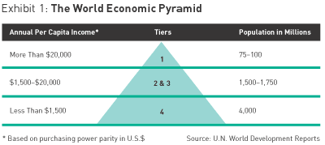
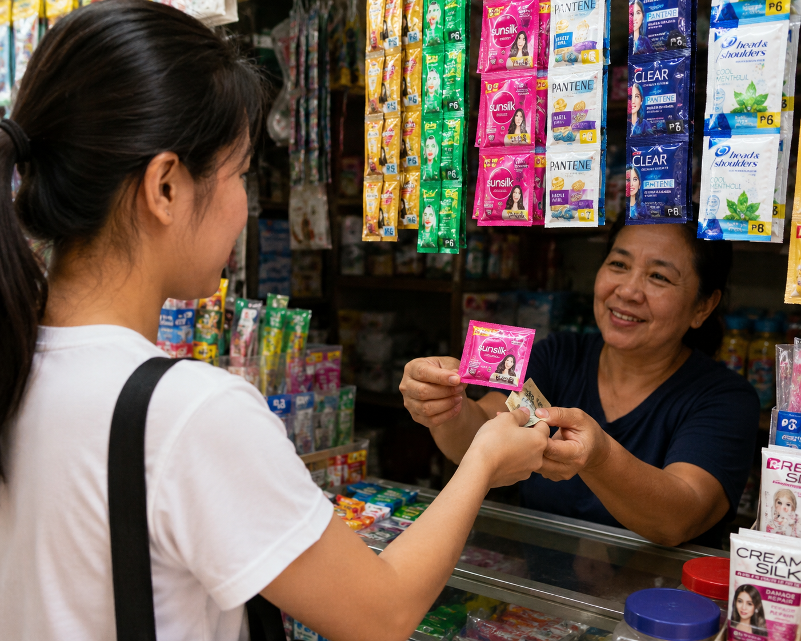
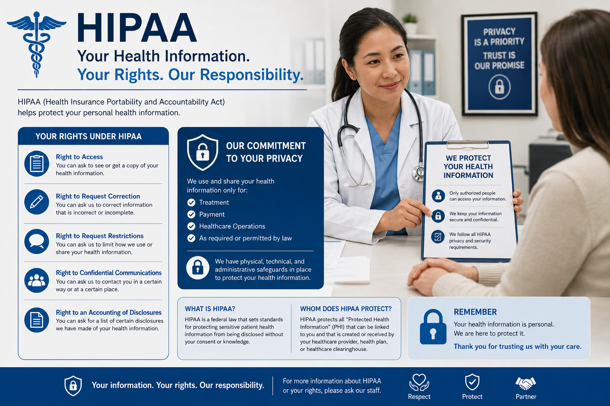
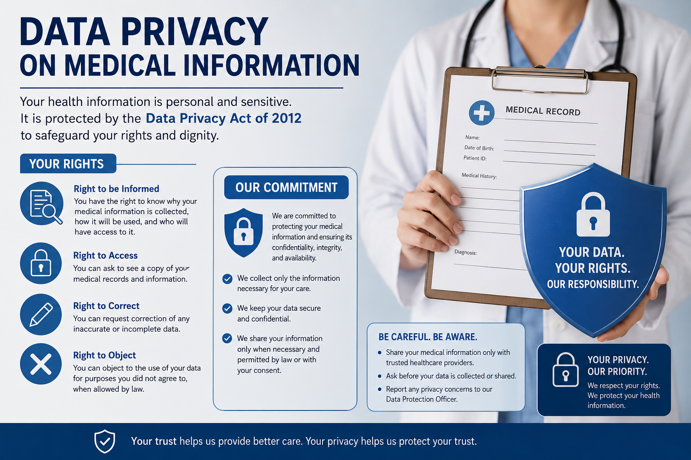

# PROFISS - Week 02 - May 13, 2026

---

## Topic 1: Fortune at the Bottom of the Pyramid[^1]

The key argument of the article The fortune at the bottom of the pyramid is that multinational corporations (MNCs) are overlooking a massive, multitrillion-dollar market opportunity by ignoring the world's 4 billion poorest people, referred to as Tier 4 or the "bottom of the pyramid."

Authors C.K. Prahalad and Stuart L. Hart argue that instead of leaving these populations to governments and nonprofits, businesses can achieve profitable growth while simultaneously alleviating poverty by rethinking their traditional business models.

### Core Components of the Argument

**Radical Innovation**

Serving this market requires shifting from high-margin, low-volume models to low-margin, high-volume ones. This demands innovations in technology, packaging (e.g., single-serve sachets), and distribution.

**Challenging Corporate Orthodoxies**

Companies must abandon false assumptions—such as the idea that the poor cannot afford products or that they don't appreciate new technology.

**Infrastructure Creation**

Success depends on building a "commercial infrastructure" tailored to the poor, which includes:

- Creating buying power through **microcredit**
- Improving access via localized distribution networks
- Shaping aspirations through consumer education

**Sustainability as a Driver**

Because Tier 4 lacks established infrastructure, it serves as an ideal testing ground for environmentally sustainable technologies (like renewable energy) that can eventually be "exported" back to developed markets.

**Global Stability**

Engaging the poor in the formal economy is presented as a way to avert social decay, political chaos, and extremism, creating a more stable global environment for all businesses.

[^1]: https://www.strategy-business.com/article/11518

---

## Topic 2: Data Privacy

### HIPAA[^2]

The Health Insurance Portability and Accountability Act (HIPAA) of 1996 is a US federal law protecting sensitive patient health information (PHI) from disclosure without consent. It mandates strict privacy and security standards for covered entities (providers, insurers) to handle electronic records and data securely

### RA 10173 Data Privacy Act of 2012[^3]

HIPAA is a U.S. federal law, not a Philippine law, but it applies to Philippine organizations (like BPOs and IT vendors) acting as business associates for U.S. covered entities. 

- **Applicability**

Philippine entities must comply with HIPAA if they process Protected Health Information (PHI) under a contract with a U.S. health organization.

- **Local Equivalent**

The Data Privacy Act (DPA) of 2012 (RA 10173) protects all sensitive personal information, including medical records.

- **Compliance Requirements**

Organizations must implement organizational, physical, and technical security measures, including data encryption, access controls, and incident response procedures.

- **Business Associate Agreements (BAAs)**

If a third party handles PHI (Protected Health Information), a BAA is necessary to ensure the processor is accountable

[^1]: https://www.strategy-business.com/article/11518
[^2]: https://www.cdc.gov/phlp/php/resources/health-insurance-portability-and-accountability-act-of-1996-hipaa.html
[^3]: https://privacy.gov.ph/data-privacy-act/